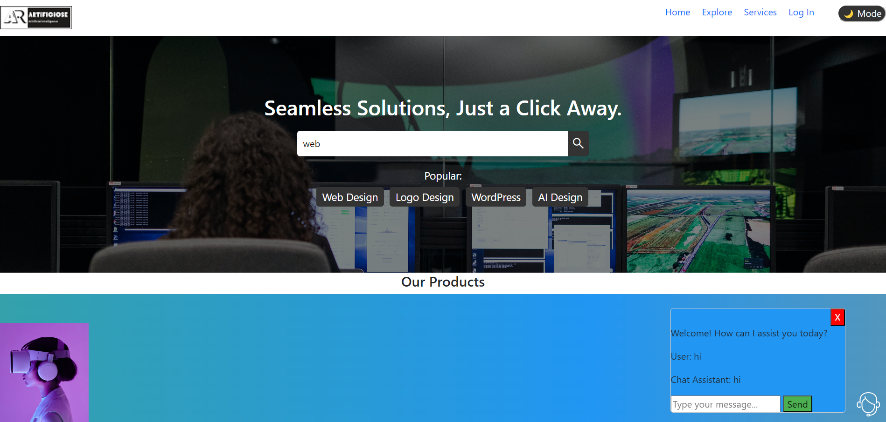
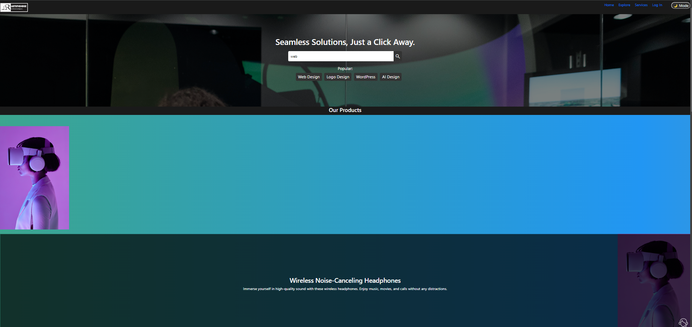
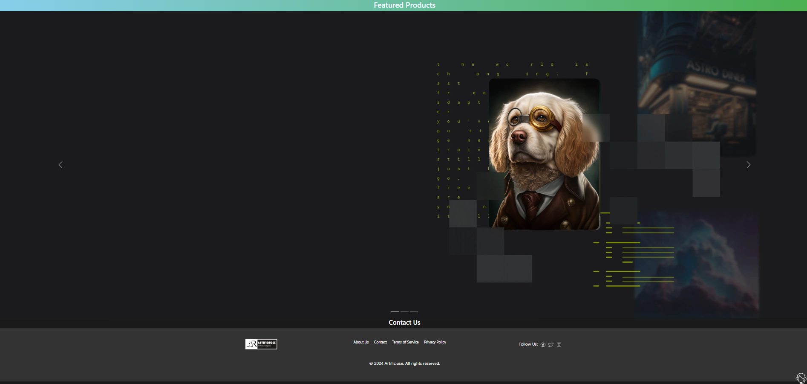
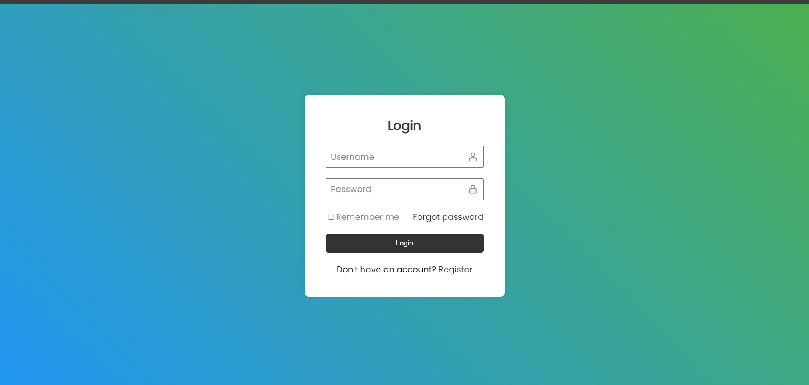

# Artificiose

## Description
ARTIFICIOSE is a website built using HTML, CSS, and JavaScript to sell AI products and IT services. The website offers a clean, structured layout with HTML, organizing sections like product catalogs, service descriptions, and contact forms using 
, 
, and <a> tags.
CSS was employed to design a responsive, modern interface, ensuring a consistent look across devices. I used Flexbox to achieve a responsive layout, and various CSS properties were applied to style fonts, buttons, and menus. Hover effects and smooth transitions add a professional touch to the user experience.
JavaScript was used to add interactivity to the website, including a dynamic shopping cart system. Users can add or remove AI products, and the cart updates in real-time. Additionally, JavaScript manages form validation, providing instant feedback to users.
Together, HTML, CSS, and JavaScript helped create a user-friendly, responsive platform for selling AI and IT services, providing both functionality and a smooth user experience.

## Screenshots

